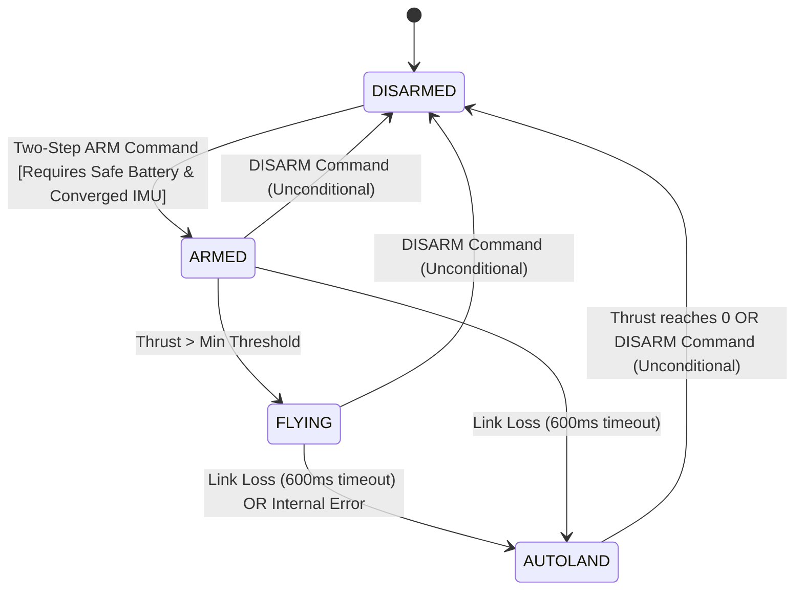

# WiFi Ground Control Interface Design Document

This document defines the architecture, message schemas, and state machine for the ESP32 quadcopter WiFi Web Control interface, replacing the legacy UDP/CRTP mobile app.

---

## 1. System Architecture Diagram

```mermaid
graph TD
    subgraph Web Client (Browser)
        UI[HTML/JS Single Page UI]
        WS_Client[WebSocket Client]
        UI -->|User Input| WS_Client
        WS_Client -->|Telemetry Panel| UI
    end

    subgraph ESP32 (PRO_CPU Core 0)
        HTTP_Server[esp_http_server]
        WS_Server[WebSocket Endpoint /ws]
        WDG[Watchdog Timer / Task]
        STATE[Control State Machine]
        
        HTTP_Server -->|Serve HTML from Flash| UI
        WS_Client <===>|WS Control / Telemetry| WS_Server
        WS_Server -->|Heartbeats / Commands| WDG
        WS_Server -->|Control Commands| STATE
        WDG -->|Watchdog Timeout| STATE
    end

    subgraph ESP32 Flight Stack (APP_CPU Core 1)
        COMM[Commander Module]
        STAB[Stabilizer Task 1kHz]
        CONT[PID Controller]
        POW[Power Distribution]
        MOT[Motor Drivers]

        STATE -->|Setpoints: commanderSetSetpoint| COMM
        COMM -->|Get Setpoint| STAB
        STAB --> CONT
        CONT --> POW
        POW --> MOT
    end
```

---

## 2. Task Configuration

All new `webctrl` tasks are pinned to Core 0 (`PRO_CPU`), where the network stack runs, leaving Core 1 (`APP_CPU`) dedicated to the real-time flight control loop.

| Task Name | Core | Priority | Stack Size | Period / Freq | Description |
| :--- | :---: | :---: | :---: | :---: | :--- |
| `httpd` (Server) | 0 | 2 (Low) | 4096 bytes | Event-driven | Handles HTTP GET and WebSocket frames. |
| `webctrl_telemetry` | 0 | 2 (Low) | 3072 bytes | 10 Hz (100 ms) | Serializes sensor data and pushes to WebSocket. |
| `webctrl_timer` | 0 | 3 (Med) | 2048 bytes | 20 ms | Executes watchdog checks, slew-rate limiting, autoland ramping, and pushes setpoints to Commander. |

---

## 3. Protocol Message Formats

All messages are JSON-formatted to optimize integration with the browser and ensure extensibility. Protocol Version is locked at `1`.

### 3.1. Command Frame (Client -> Drone)
Sent at 10-20 Hz (or on user input change). Also serves as a heartbeat.
```json
{
  "v": 1,
  "t": "cmd",
  "token": 58293021,
  "seq": 1084,
  "roll": 0.0,
  "pitch": 0.0,
  "yaw_rate": 0.0,
  "thrust": 0,
  "action": "none"
}
```
*   `v`: Protocol version (`1`). Must match firmware.
*   `t`: Message type (`"cmd"` or `"heartbeat"`).
*   `token`: Session token generated at connection.
*   `seq`: Sequence number, echoed back to compute link RTT.
*   `roll`: Target roll angle in degrees (`[-15.0, 15.0]`).
*   `pitch`: Target pitch angle in degrees (`[-15.0, 15.0]`).
*   `yaw_rate`: Target yaw rate in deg/s (`[-60.0, 60.0]`).
*   `thrust`: Target thrust unit (`[0, 60000]`).
*   `action`: Arming commands (`"arm"`, `"disarm"`, `"takeoff_step"`, `"down_step"`, `"land"`, `"release"`).

### 3.2. Heartbeat Frame (Client -> Drone)
Sent every 200 ms if no manual command is active.
```json
{
  "v": 1,
  "t": "heartbeat",
  "token": 58293021,
  "seq": 1085
}
```

### 3.3. Telemetry Frame (Drone -> Client)
Sent at 10 Hz.
```json
{
  "v": 1,
  "t": "telemetry",
  "seq_echo": 1084,
  "roll": 0.12,
  "pitch": -0.45,
  "yaw": 12.3,
  "thrust": 15000,
  "battery": 3.82,
  "state": "ARMED",
  "stab_freq": 1000.2,
  "controlled": true,
  "dropped_packets": 0
}
```
*   `seq_echo`: The `seq` value from the last received client packet. Used by client to measure RTT.
*   `battery`: Battery voltage in volts (1S LiPo).
*   `state`: Current flight controller state (`"DISARMED"`, `"ARMED"`, `"FLYING"`, `"AUTOLAND"`).
*   `stab_freq`: Measured frequency of the stabilizer loop in Hz.
*   `controlled`: `true` if the connected client currently has flight control, `false` if telemetry-only.

---

## 4. State Machine

The firmware implements an explicit state machine for control transitions. Transitions are strictly validated.



### 4.1. State Machine Transitions

| Current State | Input / Event | Target State | Action / Side Effect |
| :--- | :--- | :--- | :--- |
| **DISARMED** | `"arm"` action (step 2) | **ARMED** | Check battery > 3.2V, check roll/pitch within 5.0 deg. Switch motor mode. |
| **ARMED** | `"disarm"` action | **DISARMED** | Shut off motors immediately, reset target thrust to 0. |
| **ARMED** | `thrust` > min thrust | **FLYING** | Transition flight mode to active control. |
| **FLYING** | `"disarm"` action | **DISARMED** | Shut off motors immediately (Cut throttle). |
| **FLYING** | `"land"` command | **AUTOLAND** | Transition to autoland sequence. |
| **FLYING**/**ARMED** | Watchdog Timeout (>600 ms) | **AUTOLAND** | Log fault, start automatic thrust ramp down. |
| **AUTOLAND** | `"disarm"` action | **DISARMED** | Cut throttle immediately. |
| **AUTOLAND** | Ramp complete (thrust = 0) | **DISARMED** | Disarm flight stack. |

---

## 5. Safety & Real-Time Considerations

### 5.1. Link Watchdog (S1)
A watchdog timer monitors the arrival of WebSocket packets.
*   If no packet is received for 600 ms while `ARMED` or `FLYING`, the state machine transitions to `AUTOLAND`.
*   During `AUTOLAND`, thrust is ramped down to 0 at a rate of `-30000 units/second` (~2 s total), while roll/pitch are held at 0 (level flight).

### 5.2. Arming Interlock (S2)
Arming requires:
1.  An explicit double-click or toggle-to-arm from the client.
2.  Battery voltage measured via ADC must be $\ge 3.2\text{ V}$.
3.  Attitude estimates must be converged: sensors must be calibrated (`sensorsAreCalibrated()`), and estimated roll/pitch must be within $\pm 5.0^\circ$.

### 5.3. Clamping and Slew-Rate Limiting (S4)
Client commands are never applied directly. The `webctrl_timer` task filters them:
*   **Roll / Pitch Clamping**: Clipped to $\pm 15.0^\circ$. Slew rate limited to $60.0^\circ/\text{s}$.
*   **Yaw Rate Clamping**: Clipped to $\pm 45.0^\circ/\text{s}$. Slew rate limited to $90.0^\circ/\text{s}^2$.
*   **Thrust Clamping**: Clipped to `[0, 55000]`. Slew rate limited to `20000 units/second`.

### 5.4. Thread Safety (L4)
The WebSocket task (receives commands) and the timer task (reads commands & updates stabilizer) share a setpoint struct. This struct is protected by a FreeRTOS Mutex.
*   **No Priority Inversion**: The flight control loop (stabilizer task) runs at priority 5 and does *not* read this setpoint struct directly. Instead, it reads from the pre-existing FreeRTOS queue (`setpointQueue` in `commander.c`), populated via `commanderSetSetpoint()` which uses non-blocking `xQueueOverwrite`. Thus, the stabilizer task is never blocked by a lock held by the lower-priority `webctrl` tasks.
